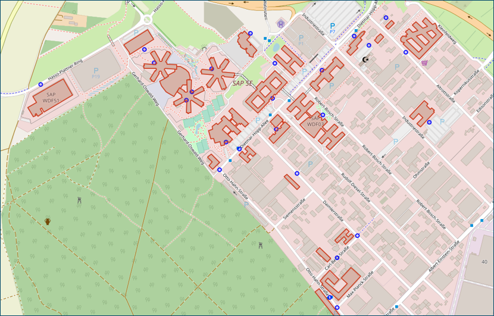

# Where are you going? | SAP HANA Graph Community Challenge
2022-05-19 
[Challenge accepted! SAP HANA Graph Challenge 2022 – Submission open!](https://blogs.sap.com/2022/05/19/challenge-accepted-sap-hana-graph-challenge-2022-submission-open/)
 
You work in WDF 53, your friend is in WDF 13. You haven’t seen each other in a while and therefore want to meet to have a chat over some coffee. Having busy schedules, you want to avoid that one must walk all the way while the other one can just stay in his building. Help them to find the building “in between”, so both of you need to walk a minimal distance.

We are challenging you to determine the building which is in the closest walking distance (fair share for both colleagues) from both buildings, WDF53 and WDF13, using SAP HANA Graph. We are looking for the building name and the distance from building WDF13 and WDF53 to the building where the meeting will take place.

*The challenge will end on June 19, 2022.*

You can find our [video kicking off the challenge on Youtube](https://www.youtube.com/watch?v=oaSQu9laYKE).

Details on how to **submit solutions to the challenge** are found in Susen's blog post [Challenge accepted! SAP HANA Graph Challenge 2022 – Submission open!](https://blogs.sap.com/2022/05/19/challenge-accepted-sap-hana-graph-challenge-2022-submission-open/)

The [data](data/) folder of this GitHub repository contains the data for this community challenge. It is provided as a SAP HANA Cloud database export. Just download *2022_GRAPH_CHALLENGE.tar.gz* to your local computer. The use the SAP HANA Database Explorer, right-click the "catalog" structure of your database, and choose "import catalog objects". [See an example for importing catalog objects.](https://github.com/SAP-samples/teched2021-DAT262/tree/main/exercises/ex1#subex1)

