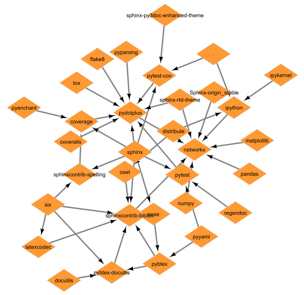

# Dependency Analysis using SAP HANA Graph
This folder contains the [data](data/) and the [script](script/) for some common dependency analysis patterns.
The scenario is described in the blog post [Know Your Dependencies - Network Tracing with SAP HANA Graph](https://blogs.sap.com/2021/05/19/know-your-dependencies-network-tracing-with-sap-hana-graph/).
To run the script yourself, you need a **SAP HANA Cloud instance**. See [SAP HANA Cloud trial website](https://www.sap.com/cmp/td/sap-hana-cloud-trial.html) for setup instructions.

The image shows the dependencies of the python package "networkx". The raw data is taken from [http://kgullikson88.github.io/blog/pypi-analysis.html](http://kgullikson88.github.io/blog/pypi-analysis.html).

