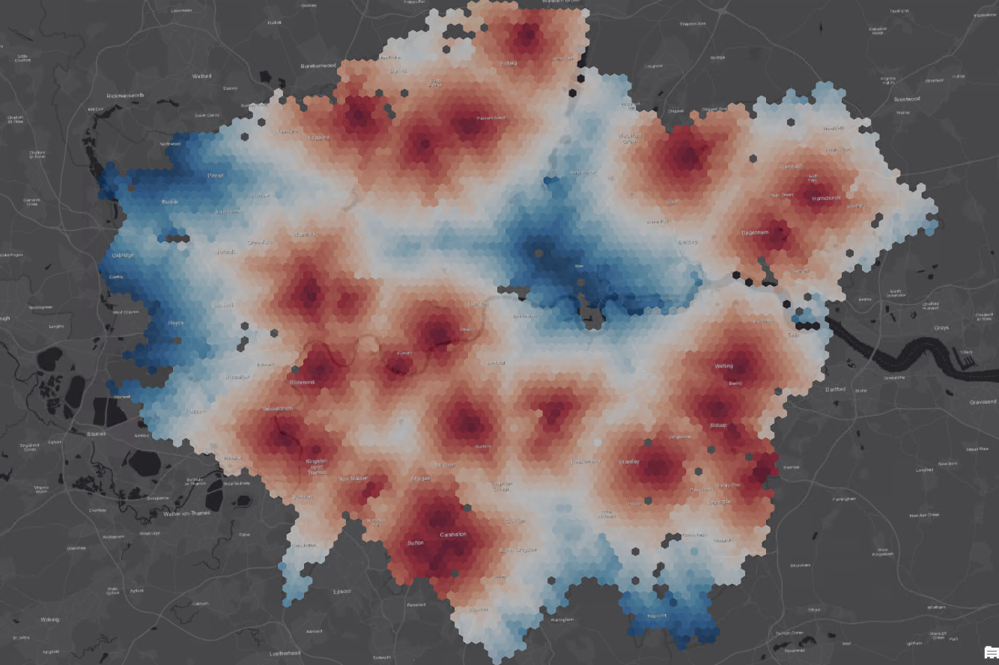

# Calculating Isochrones using SAP HANA Graph and Spatial
This folder contains the [data](data/) and [script](script/2020Q4_Isochrones_pub.sql) to calculate isochrones on the London street network.
The scenario is described in the blog post [Calculating Isochrones using SAP HANA Graph and Spatial ](https://blogs.sap.com/2021/01/05/calculating-isochrones-using-sap-hana-graph-and-spatial/).
To run the script yourself, you need a **SAP HANA Cloud instance** and **DBeaver** for spatial data visualization. See [TechEd DAT 260](https://github.com/SAP-samples/teched2020-DAT260/tree/main/exercises/ex0) for setup instructions of SAP HANA Cloud trial and DBeaver.
Before you import the [data for this script](data/) using SAP HANA Database Explorer, you need to create a spatial reference system:

´CREATE PREDEFINED SPATIAL REFERENCE SYSTEM IDENTIFIED BY 32630;´

The image shows isochrones for swimming pools in London on a street network of 1.5 mio. road segments. Areas of the same color indicate the same drive time distance.

