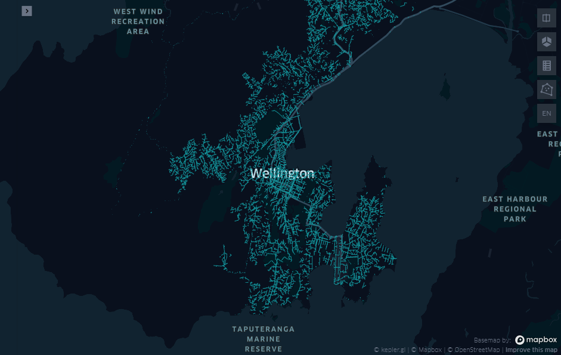

This folder contains the data and Jupyter Notebook discussed in the 2021 Q3 blog post [Augment your Python Analysis with Multi-Model data in SAP HANA Cloud](https://blogs.sap.com/2021/07/21/augment-your-python-analysis-with-multi-model-data-in-sap-hana-cloud/). In the tutorial, it is shown how to use the [SAP HANA Python Client API](https://pypi.org/project/hana-ml/) for analyzing a water network.

