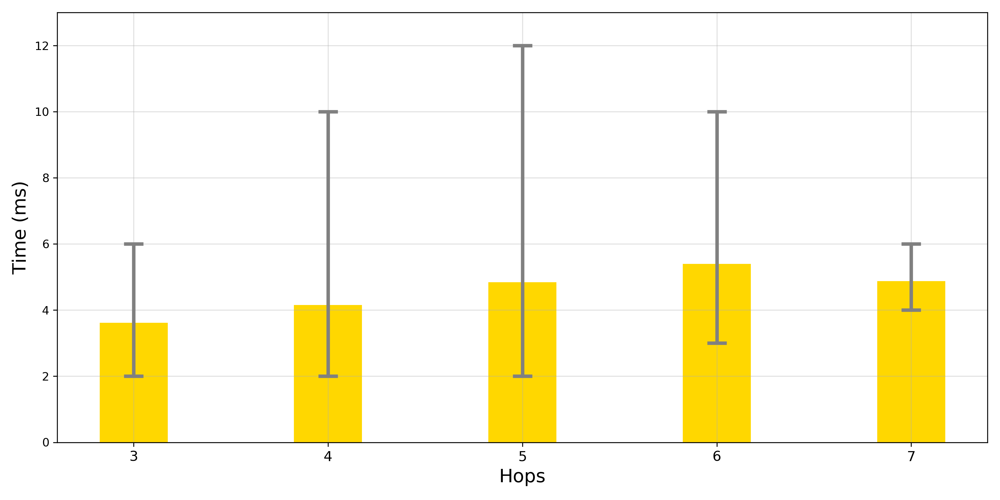

This script relates to Umang's 2020 blog post ["Find Your Path – With SAP HANA Graph"](https://blogs.sap.com/2020/10/22/find-your-path-with-sap-hana-graph/). It contains the code to run 1000 shortest path queries either sequentially or in parallel.

