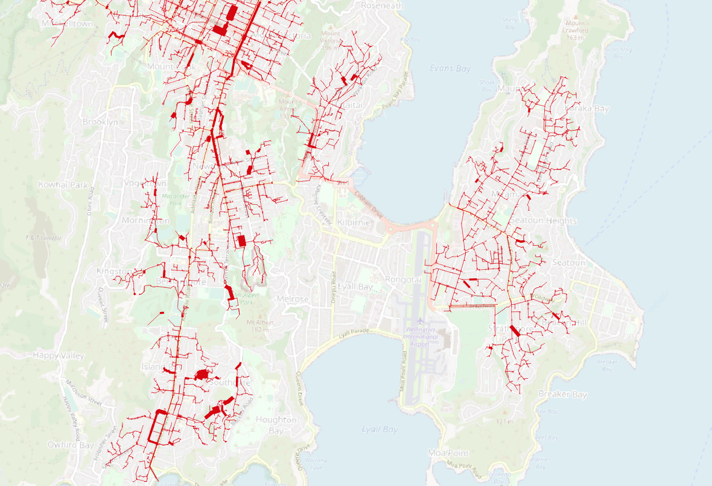

# Mapping Risk in a Stormwater Network using SAP HANA Spatial and Graph
This folder contains the [data](data/) and the [script](script/) for a stormwater network analysis scenario.
The scenario is described in the blog post [Mapping Risk in a Stormwater Network using SAP HANA Spatial and Graph]().
To run the script yourself, you need a **SAP HANA Cloud instance**. See [SAP HANA Cloud trial website](https://www.sap.com/cmp/td/sap-hana-cloud-trial.html) for setup instructions.

The image shows the potential risky network pipes. The raw data is taken from [Wellington Water Open Data Portal](https://data-wellingtonwater.opendata.arcgis.com/datasets/d70eead642bf49e393a3b199f0c63e8c_15/explore?location=-41.309742%2C174.802830%2C13.35).

